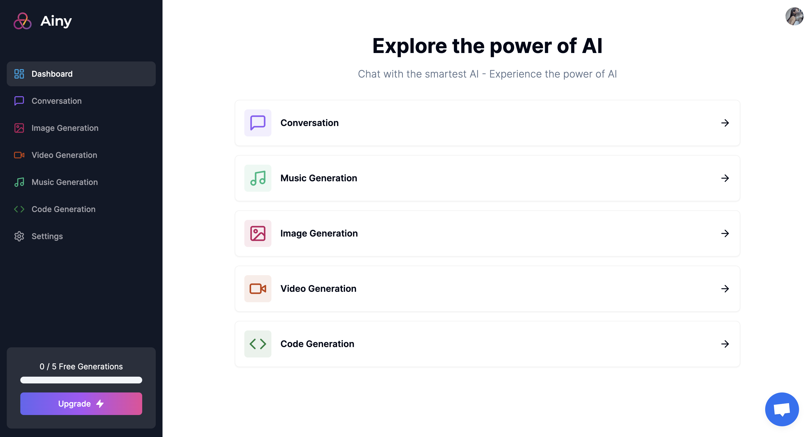

# SaaS AI Platform


Welcome to the repository of our cutting-edge SaaS AI Platform, where we leverage the power of OpenAI and Replicate API to create images, videos, music, and more, tailored to user requests.

## Live Demo
Check the live [demo](https://ainy-next14-ai-saas.vercel.app) here!

## Features

- **Tailwind Design**: Utilizing `Shadcn/ui` for a sleek, modern UI with Tailwind animations and full responsiveness.
- **Clerk Authentication**: Secure login with email, Google, and 9+ social logins.
- **Form Validation**: Client-side form handling with `react-hook-form`.
- **Error Handling**: Server-side error feedback with `react-toast`.
- **AI Tools**: 
  - Image Generation with OpenAI.
  - Video Generation with Replicate AI.
  - Conversation Generation with OpenAI.
  - Music Generation with Replicate AI.
- **Subscription Management**: Integrated Stripe for monthly subscription handling.
- **API Limiting**: Free tier with limited API access to manage resource usage.

## Tech Stack

- Frontend: Tailwind CSS, React.js
- Backend: Node.js, Express.js
- Database: Prisma, PlanetScale
- Authentication: Clerk
- AI Services: OpenAI, Replicate AI
- Payment Processing: Stripe

## Getting Started

### Prerequisites

- Node.js
- npm or yarn
- Stripe account for payment processing
- Clerk account for authentication
- Folder structure in Next 14 App Router

### Installation

## Prerequisites
Node version 18.x.x

### Structure
```
📦 ainy-next14-ai-saas
├─ .eslintrc.json
├─ .gitignore
├─ README.md
├─ app
│  ├─ (auth)
│  │  ├─ (routes)
│  │  │  ├─ sign-in
│  │  │  │  └─ [[...sign-in]]
│  │  │  │     └─ page.tsx
│  │  │  └─ sign-up
│  │  │     └─ [[...sign-up]]
│  │  │        └─ page.tsx
│  │  ├─ error.tsx
│  │  └─ layout.tsx
│  ├─ (dashboard)
│  │  ├─ (routes)
│  │  │  ├─ code
│  │  │  │  ├─ constants.ts
│  │  │  │  └─ page.tsx
│  │  │  ├─ conversation
│  │  │  │  ├─ constants.ts
│  │  │  │  └─ page.tsx
│  │  │  ├─ dashboard
│  │  │  │  └─ page.tsx
│  │  │  ├─ image
│  │  │  │  ├─ constants.ts
│  │  │  │  └─ page.tsx
│  │  │  ├─ music
│  │  │  │  ├─ constants.ts
│  │  │  │  └─ page.tsx
│  │  │  ├─ settings
│  │  │  │  └─ page.tsx
│  │  │  └─ video
│  │  │     ├─ constants.ts
│  │  │     └─ page.tsx
│  │  ├─ error.tsx
│  │  └─ layout.tsx
│  ├─ (landing)
│  │  ├─ error.tsx
│  │  ├─ layout.tsx
│  │  └─ page.tsx
│  ├─ api
│  │  ├─ code
│  │  │  └─ route.ts
│  │  ├─ conversation
│  │  │  └─ route.ts
│  │  ├─ image
│  │  │  └─ route.ts
│  │  ├─ music
│  │  │  └─ route.ts
│  │  ├─ stripe
│  │  │  └─ route.ts
│  │  ├─ video
│  │  │  └─ route.ts
│  │  └─ webhook
│  │     └─ route.ts
│  ├─ favicon.ico
│  ├─ globals.css
│  └─ layout.tsx
├─ components.json
├─ components
│  ├─ bot-avatar.tsx
│  ├─ crisp-chat.tsx
│  ├─ crisp-provider.tsx
│  ├─ empty.tsx
│  ├─ free-counter.tsx
│  ├─ heading.tsx
│  ├─ landing-content.tsx
│  ├─ landing-hero.tsx
│  ├─ landing-navbar.tsx
│  ├─ loader.tsx
│  ├─ mobile-sidebar.tsx
│  ├─ modal-provider.tsx
│  ├─ navbar.tsx
│  ├─ pro-modal.tsx
│  ├─ sidebar.tsx
│  ├─ subscription-button.tsx
│  ├─ toaster-provider.tsx
│  ├─ ui
│  │  ├─ avatar.tsx
│  │  ├─ badge.tsx
│  │  ├─ button.tsx
│  │  ├─ card.tsx
│  │  ├─ dialog.tsx
│  │  ├─ form.tsx
│  │  ├─ input.tsx
│  │  ├─ label.tsx
│  │  ├─ progress.tsx
│  │  ├─ select.tsx
│  │  └─ sheet.tsx
│  └─ user-avatar.tsx
├─ constants.ts
├─ dashboard-mainpage.png
├─ hooks
│  └─ use-pro-modal.tsx
├─ lib
│  ├─ api-limit.ts
│  ├─ prismadb.ts
│  ├─ stripe.ts
│  ├─ subscription.ts
│  └─ utils.ts
├─ middleware.ts
├─ next.config.js
├─ package-lock.json
├─ package.json
├─ postcss.config.js
├─ prisma
│  └─ schema.prisma
├─ public
│  ├─ empty.png
│  ├─ logo.png
│  ├─ next.svg
│  └─ vercel.svg
├─ tailwind.config.js
├─ tailwind.config.ts
└─ tsconfig.json
```


### 0. Cloning the repository

```shell
git clone https://github.com/Ychen463/ainy-next14-ai-saas.git
```

### 1. Install dependencies:

```shell
npm i
```

### 2. Set up your environment variables in a `.env` file 
Based on the .env.example provided.

```js
NEXT_PUBLIC_CLERK_PUBLISHABLE_KEY=
CLERK_SECRET_KEY=

NEXT_PUBLIC_CLERK_SIGN_IN_URL=/sign-in
NEXT_PUBLIC_CLERK_SIGN_UP_URL=/sign-up
NEXT_PUBLIC_CLERK_AFTER_SIGN_IN_URL=/dashboard
NEXT_PUBLIC_CLERK_AFTER_SIGN_UP_URL=/dashboard

OPENAI_API_KEY=
REPLICATE_API_TOKEN=

DATABASE_URL=

STRIPE_API_KEY=
STRIPE_WEBHOOK_SECRET=

NEXT_PUBLIC_APP_URL="http://localhost:3000"
```

### 3. Setup Prisma

Add MySQL Database (I used PlanetScale)

```shell
npx prisma db push

```


### 4. Start the app
Running commands with npm `npm run [command]`

| command         | description                              |
| :-------------- | :--------------------------------------- |
| `dev`           | Starts a development instance of the app |

```bash
npm run dev
# or
yarn dev
# or
pnpm dev
# or
bun dev
```

Open [http://localhost:3000](http://localhost:3000) with your browser to see the result.

You can start editing the page by modifying `app/dashboard.tsx`. The page auto-updates as you edit the file.

This project uses [`next/font`](https://nextjs.org/docs/basic-features/font-optimization) to automatically optimize and load Inter, a custom Google Font.

## Learn More

To learn more about Next.js, take a look at the following resources:

- [Next.js Documentation](https://nextjs.org/docs) - learn about Next.js features and API.
- [Learn Next.js](https://nextjs.org/learn) - an interactive Next.js tutorial.

You can check out [the Next.js GitHub repository](https://github.com/vercel/next.js/) - your feedback and contributions are welcome!

## Deploy on Vercel

The easiest way to deploy your Next.js app is to use the [Vercel Platform](https://vercel.com/new?utm_medium=default-template&filter=next.js&utm_source=create-next-app&utm_campaign=create-next-app-readme) from the creators of Next.js.


Check out our [Next.js deployment documentation](https://nextjs.org/docs/deployment) for more details.
